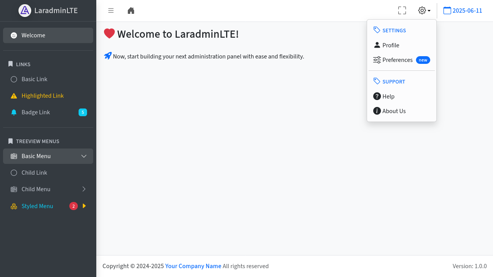

[](https://packagist.org/packages/dfsmania/LaradminLTE)
[](https://github.com/dfsmania/LaradminLTE/actions/workflows/run-pint.yml)

# LaradminLTE: AdminLTE v4 for Laravel

**LaradminLTE** is a Laravel package that seamlessly integrates the powerful [AdminLTE v4](https://adminlte-v4.netlify.app) dashboard template into [Laravel](https://laravel.com/) (v10 or higher). Designed for modern web applications, this package provides a fast and flexible way to build responsive, maintainable, and feature-rich admin panels by using a Laravel [Blade component](https://laravel.com/docs/blade#components) to quick access the layout and configuration files to customize it.

> [!CAUTION]
> **Active Development**: **LaradminLTE** is currently under active development. Features, configuration options, and behavior are subject to change until the first stable release.

## Requirements

- **Laravel**: 10 or higher
- **PHP**: 8.1 or higher

## Installation

Follow these steps to install **LaradminLTE** in your Laravel application:

### 1. Install the Package

Use [Composer](https://getcomposer.org/) to add the package to your Laravel project:

```bash
composer require dfsmania/laradminlte:dev-main --prefer-stable
```

### 2. Publish Package Resources

Run the following commands to publish the basic package's assets and configuration files:

```bash
php artisan vendor:publish --provider="DFSmania\LaradminLte\LaradminLteServiceProvider" --tag="assets" --tag="config"
```

This command will publish the following elements to your application:

- **Assets**: The set of **AdminLTE v4** distribution files (`CSS`, `JS`) and some images in the `public/vendor/ladmin` folder of your Laravel application.
- **Config**: The package configuration files in the `config/ladmin` folder of your Laravel application.

## Usage

Follow these steps to use, configure and test **LaradminLTE** in your Laravel application:

### 1. Create a Test Route and View

Set up a test route in your `routes/web.php` file:

```php
Route::get('ladmin_welcome', function () {
    return view('laradminlte-welcome');
});
```

Next, create a Blade view to test the package's functionality. The package provides a main blade component that should be used to render the layout.
As example, save the following content in `resources/views/laradminlte-welcome.blade.php`:

```blade
<x-ladmin-panel title="Welcome">

    {{-- Setup the content header --}}
    <x-slot name="contentHeader">
        <div class="row">
            <div class="col-12">
                <h3 class="fw-bold">
                    <i class="bi bi-heart-fill text-danger"></i>
                    Welcome to LaradminLTE!
                </h3>
            </div>
        </div>
    </x-slot>

    {{-- Setup the content body --}}
    <div class="row">
        <div class="col-12">
            <i class="bi bi-rocket-takeoff-fill fs-5 text-primary"></i>
            Now, start building your next administration panel with ease and flexibility.
        </div>
    </div>

    {{-- Push inline scripts if needed --}}
    @push('js')
        <script>
            console.log('LaradminLTE is successfully loaded!');
        </script>
    @endpush

</x-ladmin-panel>
```

- The `title` attribute of the main component sets the page title, which is automatically appended to your application's name and shown in the browser's title bar.
- The `contentHeader` slot is used to define the header section of the content area.
- The main content body is placed directly within the main component tags.
- The `@push('js')` directive allows you to add custom JavaScript code that will be included in the layout.
- The `@push('css')` directive can also be used to add custom CSS styles if needed.

### 2. Test your Route/View

To visualize the admin layout, open your browser and navigate to:

```sh
http://your-app.test/ladmin_welcome
```

Replace `your-app.test` with your local development URL. You should now see the default admin layout rendered using the package’s out-of-the-box configuration:



### 3. Customize Configuration

Explore and modify the package's configuration files to suit your needs:

- `config/ladmin/main.php`: General settings for the admin panel.
- `config/ladmin/menu.php`: Define the menu structure.
- `config/ladmin/plugins.php`: Manage plugins and extensions.

For detailed usage instructions, advanced configuration options, and customization guides, refer to the [Official LaradminLTE Documentation](https://dfsmania.github.io/LaradminLTE).

## Contributing

Thank you for your interest in contributing to *LaradminLTE*! We welcome and appreciate all contributions that help improve the project. Please take a moment to review our guidelines on [the Contribute page](https://github.com/dfsmania/LaradminLTE/contribute) before getting started.
